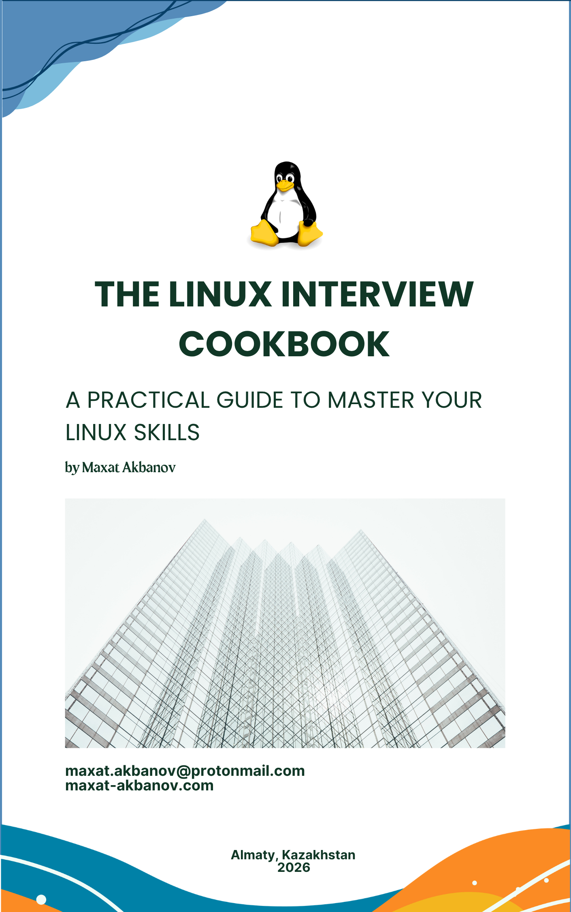

# companion-the-linux-interview-cookbook

## Exercises

- **Chapter 1: Linux Internals**
    - [Linux Kernel Compilation](./chapter-1/kernel-compile/)
- **Chapter 4: Storage**
    - [Extending Disk Space for a Database Server](./chapter-4/lvm/)

## Support 

If you find this book valuable, consider supporting it on Ko-fi:

